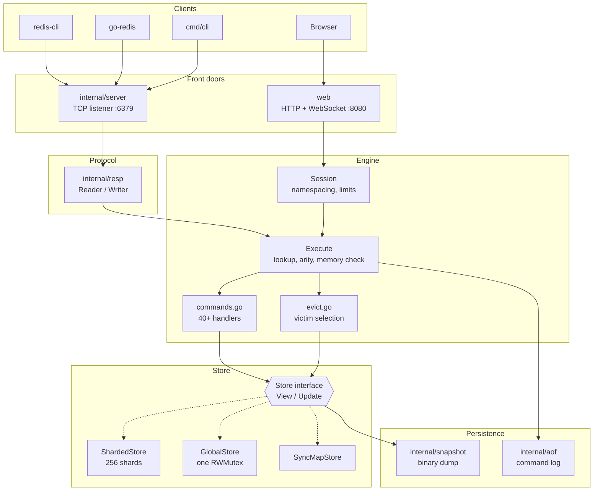
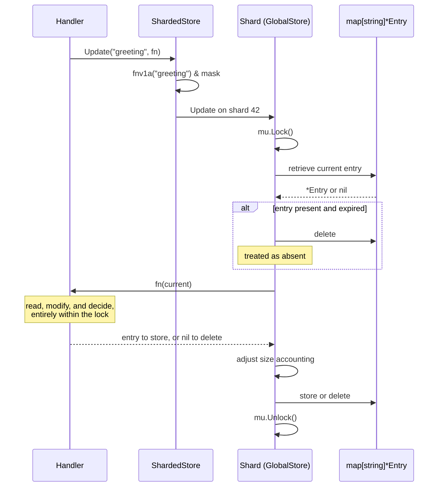
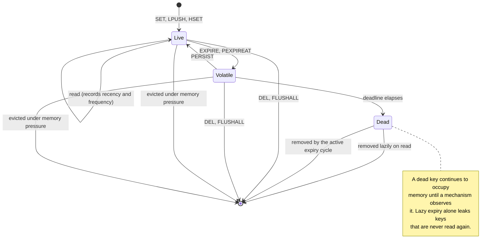
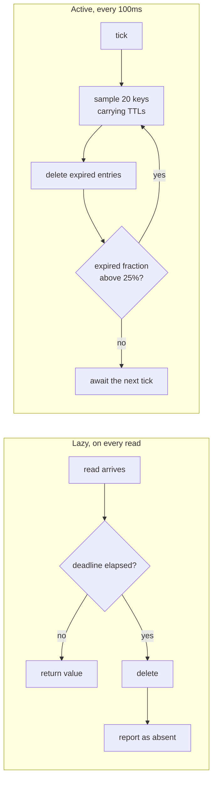
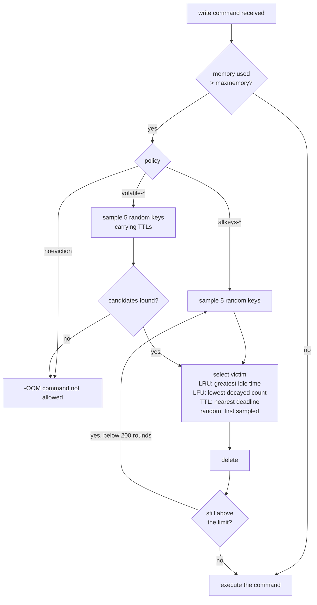
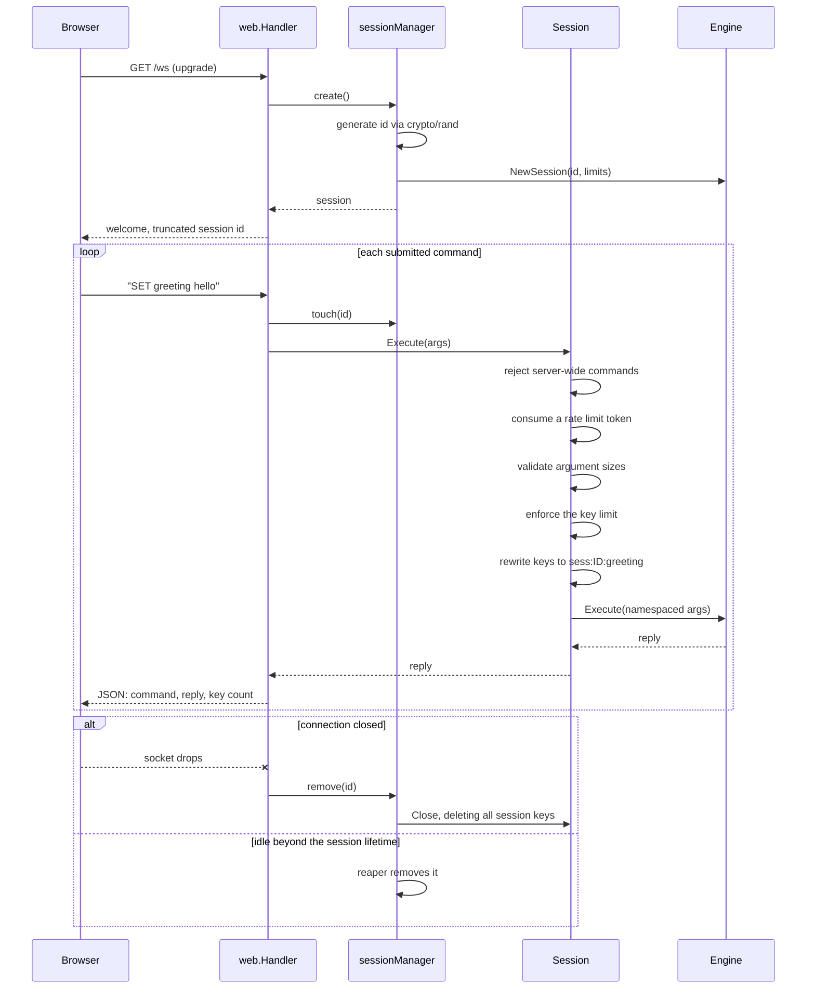

# Architecture

Component structure, call flows, and state models. Rationale for these
decisions is documented separately in [DESIGN.md](DESIGN.md).

## 1. Component overview



The engine contains no transport-specific code. Both front doors invoke the
same `Execute` method, with the result that the browser playground and
`redis-cli` exercise identical command paths.

## 2. Command execution

The sequence below traces a single `SET greeting hello` from received bytes to
transmitted reply.

```mermaid
sequenceDiagram
    participant C as Client
    participant T as TCP handler
    participant R as resp.Reader
    participant E as Engine.Execute
    participant S as Store
    participant A as AOF log
    participant W as resp.Writer

    C->>T: bytes on the socket
    T->>T: SetReadDeadline (idle timeout)
    T->>R: ReadCommand()
    R->>R: parse RESP array
    R-->>T: ["SET", "greeting", "hello"]

    T->>E: Execute(args)
    E->>E: registry lookup
    E->>E: arity validation

    alt command is a write
        E->>S: MemoryUsed()
        alt usage exceeds maxmemory
            E->>E: evictIfNeeded()
            alt policy is noeviction
                E-->>T: -OOM command not allowed
            end
        end
    end

    E->>E: increment command counter
    E->>S: Update(key, callback)
    Note over S: write lock held for<br/>the callback's duration
    S-->>E: reply value

    alt write succeeded
        E->>A: Append(args)
        Note over A: logged after execution,<br/>only on success
    end

    E-->>T: resp.Value

    T->>W: WriteNoFlush(reply)
    alt further commands already buffered
        Note over T,W: reply retained;<br/>the batch flushes together
    else no pending input
        T->>W: Flush()
        W-->>C: +OK
    end
```

Three properties of this ordering are significant.

**Memory is evaluated before the write.** Eviction reduces usage below the
limit and the write is then applied, which is why `maxmemory` is an approximate
bound rather than an invariant.

**The log is written after the handler returns.** A command that failed
validation or type checking is excluded, preventing replay from reconstructing
a state the server never held.

**Replies may be retained.** When further commands have already been parsed
into the buffer, the reply is held so that a pipelined batch incurs one write
syscall rather than one per command.

## 3. Store access protocol

All reads and writes execute inside a caller-supplied callback that the store
invokes while holding the relevant lock. No reference to an entry escapes the
critical section.



This interface replaced an earlier design in which `Get` returned `*Entry` to
the caller. That design released the lock before mutation, permitting lost
updates under concurrent `INCR` on a shared key.

## 4. Key lifecycle



`Dead` is a distinct state rather than a notational convenience. The interval
between a deadline elapsing and the associated memory being reclaimed is the
reason both expiry mechanisms are required.

## 5. Expiry

Two independent mechanisms operate concurrently.



| Parameter | Value |
|---|---|
| Cycle interval | 100 ms |
| Sample size | 20 keys |
| Continuation threshold | 25% of the sample expired |
| Maximum rounds per cycle | 16 |

Lazy expiry imposes no background cost but observes only keys that are read.
The active cycle covers the remainder. It samples rather than scans, because a
full traversal of a large keyspace would block all other operations for its
duration. The round limit bounds the work performed by any single tick.

## 6. Eviction



| Parameter | Value |
|---|---|
| Sample size per eviction | 5 keys |
| Maximum rounds per write | 200 |

Sampled selection replaces true LRU. A true implementation requires a linked
list threaded through every entry, costing two pointers per key and a list
update on every read, for an accuracy improvement that does not justify the
overhead at this scale.

## 7. Startup and recovery

```mermaid
sequenceDiagram
    participant M as main
    participant E as Engine
    participant Sn as Snapshot
    participant A as AOF
    participant L as Listeners

    M->>E: New(ConfigFromEnv())
    M->>E: EnableAOF()

    E->>Sn: Load(redisgo.rdb)
    Note over Sn: the older, coarser record
    Sn-->>E: records, excluding those already expired
    E->>E: Restore each, bypassing dispatch

    E->>A: Replay(redisgo.aof)
    Note over A: operations recorded<br/>after the snapshot
    loop each logged command
        A->>E: Execute(args)
        Note over E: loading flag set;<br/>replay is not re-logged
    end

    E->>A: Open for appending

    M->>E: StartExpiryLoop
    M->>E: StartPersistenceLoop
    M->>L: ListenTCP and HTTP
    Note over L: clients may connect<br/>only from this point
```

The ordering is required for correctness. The snapshot represents the keyspace
as of the last dump; the log records operations that followed. Reversing the
order would allow stale snapshot values to overwrite newer logged values.

Truncation is handled differently for each format:

| Format | Behaviour on truncation | Justification |
|---|---|---|
| AOF | Replay stops at the partial record; all preceding commands are applied | Each command is independent, so partial recovery is correct recovery |
| Snapshot | Load fails with an error | A partial snapshot is a partial database; silent acceptance would present as unexplained data loss |

## 8. AOF compaction

```mermaid
stateDiagram-v2
    [*] --> Idle

    Idle --> Rewriting: BGREWRITEAOF issued
    Idle --> Rewriting: log reaches 2x its<br/>post-rewrite size

    state Rewriting {
        [*] --> Building
        Building --> Building: traverse the keyspace,<br/>emit minimal commands
        Building --> Swapping: replacement written to .rewrite
        Swapping --> [*]: close, rename, reopen
    }

    Rewriting --> Idle: new baseline recorded
    Rewriting --> Idle: failed; original retained
```



| Parameter | Value |
|---|---|
| Automatic trigger | Log size reaches 2x the post-rewrite baseline |
| Minimum size before triggering | 64 KB |
| Check interval | 30 seconds |

The replacement is constructed in a separate file, so a failure at any point
leaves the original log intact. The final swap acquires the same lock used by
appends, ensuring no command is written to a file undergoing replacement.

Compaction emits `PEXPIREAT` with an absolute timestamp rather than `EXPIRE`
with a relative duration. A relative duration would reset the countdown at
every rewrite and every restart, causing keys to outlive their intended
lifetimes indefinitely under frequent restarts.

## 9. Browser sessions



Keys are prefixed on entry and stripped on exit, presenting the appearance of a
dedicated server. `KEYS`, `DBSIZE`, and `FLUSHALL` are answered from the
session's own view rather than delegated, so no session observes the global key
count or affects another session's data.

This mechanism provides isolation between cooperating clients. It is not a
security boundary.

## 10. Concurrency model

### 10.1 Goroutines

| Goroutine | Created by | Lifetime | Scope of access |
|---|---|---|---|
| Accept loop | `ListenTCP` | Until context cancellation | The listener |
| Connection handler | One per TCP client | Until disconnect or 10 minute idle timeout | Its own reader and writer; the engine |
| WebSocket reader | One per browser connection | Until close or 60 seconds without a pong | Its session; the engine |
| WebSocket writer | One per browser connection | Paired with its reader | The connection's write side only |
| Expiry cycle | `main` | Until shutdown | The store, under write locks |
| Persistence check | `main` | Until shutdown | AOF size; may initiate compaction |
| Session reaper | `web.Handler` | Until shutdown | The session map and the store |
| Background save | `BGSAVE` | Single pass | Reads the store; writes a file |
| Background rewrite | `BGREWRITEAOF` | Single pass | Reads the store; replaces the log |

### 10.2 Synchronization

| Guard | Protects |
|---|---|
| `GlobalStore.mu`, one per shard | That shard's map and byte counter |
| `Engine.mu` | Command, connection, expiry and eviction counters; last save time |
| `Engine.rewriteMu` | AOF appends and the compaction swap |
| `Engine.maxMemory`, `Engine.policy` | Atomic; written by `CONFIG SET`, read on every write |
| `Entry.lastAccess`, `Entry.freq` | Atomic; written during reads, which hold only a read lock |
| `Engine.saving`, `Engine.rewriting` | Atomic flags limiting background passes to one at a time |
| `sessionManager.mu` | The session map |
| `Session.mu` | That session's rate limiter state |

Each WebSocket connection uses two goroutines because the underlying library
does not support concurrent writers, while both the command loop and the ping
ticker require write access. They communicate over a buffered channel; a send
that would block is discarded rather than permitted to stall the command loop.

## 11. On-disk formats

### 11.1 Append-only log

Commands are stored in RESP array form, identical to the bytes a client
transmits. The log is therefore readable with standard tools and replayable by
transmission to a socket, and requires no separate serializer.

```
*3\r\n$3\r\nSET\r\n$8\r\ngreeting\r\n$5\r\nhello\r\n
```

### 11.2 Snapshot

A custom length-prefixed binary format. All integers are little-endian
`int64`.

```
Header
  magic        8 bytes    "REDISGO1"

Record, repeated to end of file
  kind         1 byte     0 = string, 1 = list, 2 = hash
  key length   8 bytes
  key          n bytes
  expiry       8 bytes    Unix nanoseconds; 0 indicates no expiry
  payload                 determined by kind:
                            string  length, then bytes
                            list    element count, then length and bytes per element
                            hash    field count, then length and bytes per field and value
```

The magic header causes files of other formats to be rejected rather than
parsed speculatively. The `Kind` constants are declared in the snapshot package
rather than imported from the engine, so that renumbering the engine's
constants cannot alter the interpretation of existing files.
