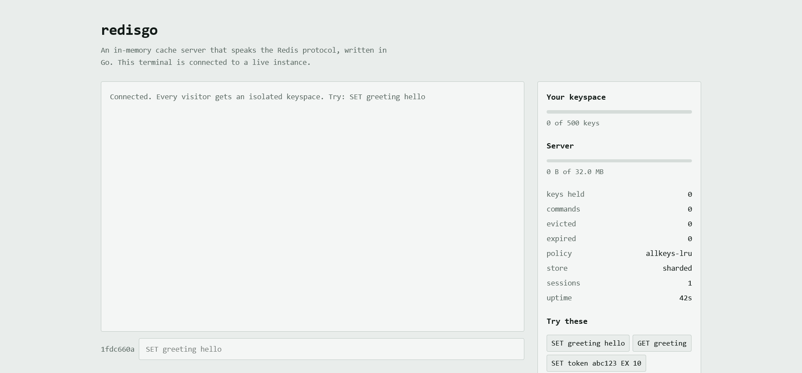
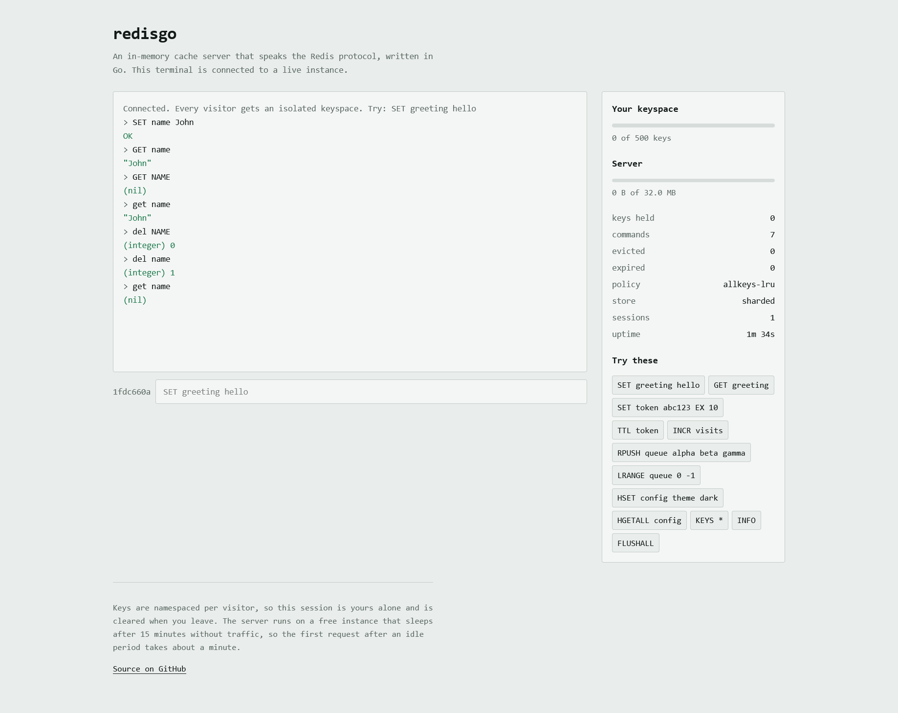

# redisgo
 
An in-memory cache server that speaks the Redis wire protocol, written in Go.
Real Redis clients connect to it without knowing the difference.
 

 
**[Live demo](https://redisgo-r2za.onrender.com/)** — a browser terminal wired to
a running instance. Every visitor gets an isolated keyspace.
 
> The demo runs on a free instance that sleeps after 15 minutes without
> traffic, so the first request after an idle period takes about a minute.
 
## What it does
 
- **RESP2 protocol**, so `redis-cli` and the standard `go-redis` client work unmodified
- **Strings, lists and hashes**, with `WRONGTYPE` errors on mismatched operations
- **Key expiry** through both mechanisms Redis uses: lazily on read, and an
  active sampling cycle for keys nobody reads again
- **A sharded concurrent store**, benchmarked against a single-mutex baseline
  and against `sync.Map`
- **Memory limits and eviction**: `noeviction`, approximated LRU, LFU with a
  decaying logarithmic counter, and the volatile variants
- **Persistence**: an append-only log with three fsync policies, log compaction,
  and binary snapshots
- **Pipelining** on both sides, so a batch costs one syscall rather than one per command
- **A browser playground** with per-visitor key namespacing, rate limits and live metrics
## Numbers
 
Measured on GitHub Actions runners (Xeon Platinum 8573C, 4 cores). Full tables
and methodology in [BENCHMARKS.md](BENCHMARKS.md).
 
| | Result |
|---|---|
| Sharded vs. single-mutex store, 512 goroutines | **2.9x** faster |
| Sharded store, 1 → 512 goroutines | 284ns → 272ns (flat) |
| Single-mutex store, same range | 616ns → 779ns (degrades) |
| Pipelined 100 commands vs. sequential | **12.5x** faster |
| Protocol decoder under fuzzing | 3.8M malformed inputs, no crashes |
| 2.8 MB written into a 1 MB limit | held at 1.05 MB, 3163 keys evicted |
 
## Running it
 
Requires Go 1.22 or later.
 
```
go run ./cmd/server
```
 
| Address | What |
|---|---|
| `:6379` | the cache, over TCP |
| `:8080` | the browser playground and metrics |
 
Connect with the real client:
 
```
redis-cli -p 6379
127.0.0.1:6379> SET greeting hello
OK
127.0.0.1:6379> GET greeting
"hello"
```
 
Or with the bundled one, which needs nothing installed:
 
```
go run ./cmd/cli
```

[Detailed Setup Instructions](SETUP.md) to follow and setup
locally or remotely

 
### Configuration
 
Everything is set through the environment.
 
| Variable | Default | What it does |
|---|---|---|
| `MAX_MEMORY_MB` | `32` | eviction threshold |
| `MAXMEMORY_POLICY` | `allkeys-lru` | `noeviction`, `allkeys-lru`, `allkeys-lfu`, `allkeys-random`, `volatile-lru`, `volatile-ttl`, `volatile-random` |
| `STORE` | `sharded` | `sharded`, `global`, `syncmap` |
| `SHARD_COUNT` | `256` | must be a power of two |
| `AOF_ENABLED` | `false` | write every command to a log |
| `AOF_SYNC` | `everysec` | `always`, `everysec`, `no` |
| `PORT` | unset | when set, the server starts in cloud mode: HTTP only |
 
Try eviction for yourself:
 
```
MAX_MEMORY_MB=1 go run ./cmd/server
```
 
Then write a few megabytes into it and watch `INFO` hold the line.

[Additional Configuration Details](CONFIGURATION.md)

 
## Tests
 
```
go test ./...              # fast
go test -race ./...        # what CI runs
go test -bench=. ./...     # benchmarks
go test -fuzz=FuzzRead ./internal/resp/
```
 
## Architecture
 
```
cmd/server       the binary, and the local/cloud mode switch
cmd/cli          a Redis client, so redis-tools is not needed to develop
internal/resp    the wire protocol: reader, writer, fuzz-tested decoder
internal/engine  the cache core: store implementations, commands, eviction
internal/aof     the append-only log and its replay
internal/snapshot  the binary point-in-time dump format
internal/server  the TCP front door
web              the HTTP front door and the embedded playground
```
 
The engine knows nothing about transports. The TCP listener and the WebSocket
bridge both call the same dispatcher, which is why a browser terminal and
`redis-cli` exercise identical code.
 
Design decisions and their reasoning are in [DESIGN.md](DESIGN.md), including
where this deliberately differs from real Redis and what it does not attempt.

[Architecture](ARCHITECTURE.md) shows a detailed view into the structure and flow
of the project.
 
## Dependencies
 
The cache engine, protocol, storage, eviction and persistence are standard
library only. Two dependencies sit at the edges: `gorilla/websocket` for the
browser handshake, and `go-redis` in tests, where it proves wire compatibility
by driving the server as an ordinary Redis client would.

## Screenshot




## Deployment
 
One binary. The static files are compiled in with `go:embed`, so there is no
separate frontend build and no Dockerfile. When `PORT` is set the server starts
the HTTP listener only, because a free web service exposes exactly one port.

## Available Commands

[Commands](COMMANDS.md)
 
## License
 
MIT
